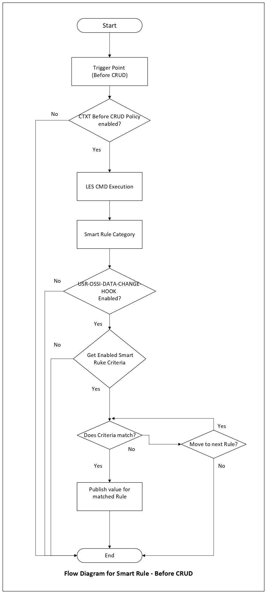
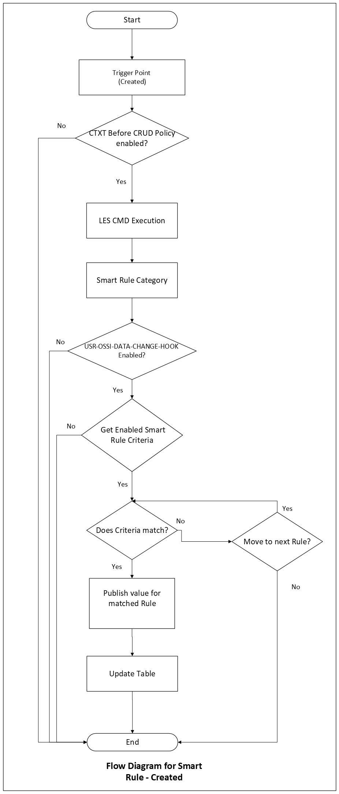
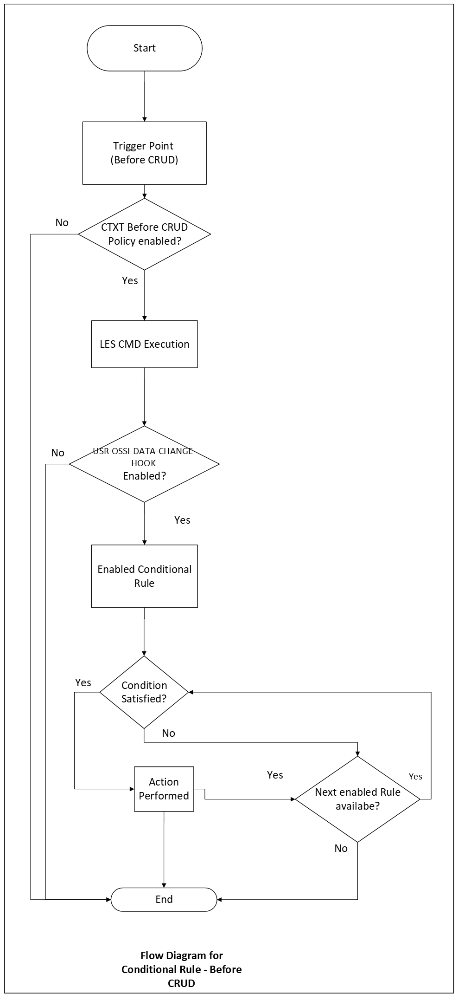
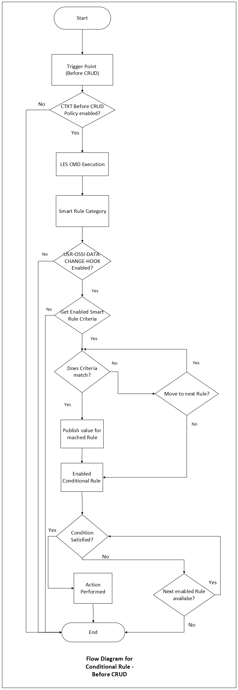

# Execution Flows

## Overview

Every rule execution in the Rule Engine — regardless of trigger point or rule 
type — follows the same underlying pattern. Understanding this pattern helps 
you predict how rules will behave, debug unexpected results, and design 
configurations that work reliably.


## The General Pattern

Every rule execution passes through the same sequence of checks before any 
rule logic runs. If any check fails, execution stops at that point — no rules 
are evaluated.

```
Trigger Point fires
        │
        ▼
1. Context Policy check (USR-CTXT-OSSI-XXX)
        │ fails → Exit
        ▼
2. LES CMD Execution (fetch supporting data)
        │
        ▼
3. Hook Policy check (USR-OSSI-DATA-CHANGE-HOOK)
        │ fails → Exit
        ▼
4. Rule evaluation (Smart or Conditional)
        │
        ▼
5. Output (value published or action performed)
        │
        ▼
       End
```


## Step-by-Step Breakdown

### 1. Context Policy Check

The system evaluates the Context Policy (`USR-CTXT-OSSI-XXX`) to determine 
whether the current transaction matches the scope defined for rule execution.

- If the policy is **not configured or disabled** → execution stops, no rules run
- If the policy **matches** → proceed to LES CMD Execution

→ See [Context Policy](./pth/policy.md)

---

### 2. LES CMD Execution

The system queries the LES CMD table to fetch any extended data not directly 
available in the rule context. This data is then available to rule conditions 
and value expressions throughout the rest of execution.

→ See [LES CMD](lescmd.md)

---

### 3. Hook Policy Check

The system checks whether `USR-OSSI-DATA-CHANGE-HOOK` is enabled for this 
trigger point.

- If the hook is **disabled (`rtnum1 = 0`)** → execution stops
- If set to **Via Job (`rtnum1 = 1`)** → rule is queued for deferred execution
- If set to **Inline (`rtnum1 = 2`)** → rule executes immediately, continue

→ See [Hook Policy](./pth/hooks.md)


### 4. Rule Evaluation

Behaviour at this step depends on the rule type active at the trigger point.

#### Smart Rule Evaluation

- Rules in the group are evaluated top-down
- The irst rule whose condition matches wins
- Its value is published
- Evaluation stops — no further rules are checked

#### Conditional Rule Evaluation

- All enabled rules in the group are evaluated
- For each rule whose condition matches, its actions execute in sequence
- Evaluation continues to the next rule unless:
  - An action returns `uc_abort_conditional_rules = 1`
  - An error occurs
  - No rules available

#### Combined Evaluation

When both rule types are active at the same trigger point, the execution 
order depends on the trigger type:

| Trigger Type | Order |
|---|---|
| **Before CRUD** | Smart Rule first → then Conditional Rule |
| **At Created** | Conditional Rule first → then Smart Rule |


### 5. Output

The final step differs by rule type:

| Rule Type | Trigger Type | Output |
|---|---|---|
| Smart Rule | Before CRUD | Value published into the open transaction |
| Smart Rule | At Created | Value published → Update Table step writes it back |
| Conditional Rule | Any | Actions performed, no value returned |


## Flow Diagrams

### Smart Rule Flows


<div style="text-align: left;">
  
   </div>
 
*Smart Rule execution at a Before CRUD trigger point.*

<div style="text-align: left;">
  
   </div>

*Smart Rule execution at an At Created trigger point. Note the additional 
Update Table step after value is published.*

### Conditional Rule Flows


<div style="text-align: left;">
  
   </div>

*Conditional Rule execution at a Before CRUD trigger point.*


### Combined Flows

<div style="text-align: left;">
  
   </div>


*Smart Rule and Conditional Rule both active at a Before CRUD trigger. 
Smart Rule resolves first, then Conditional Rule actions execute.*

<div style="text-align: left;">
  
   </div>

*Smart Rule and Conditional Rule both active at an At Created trigger. 
Conditional Rule actions execute first, then Smart Rule publishes and 
updates the table.*

---
