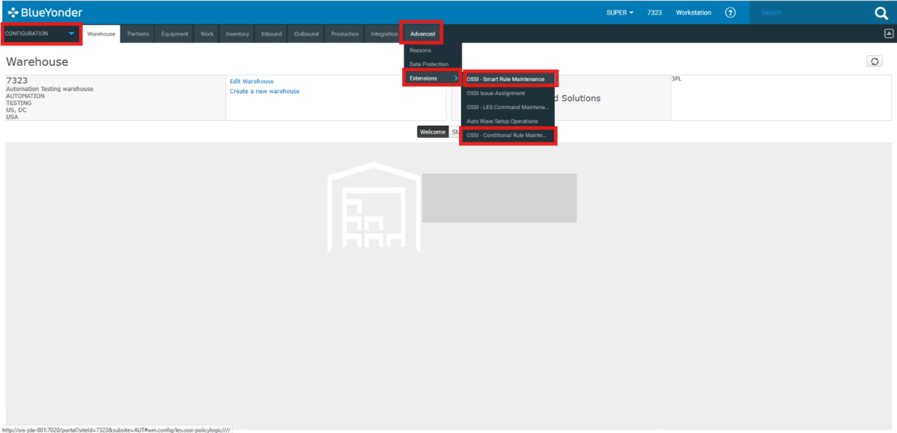
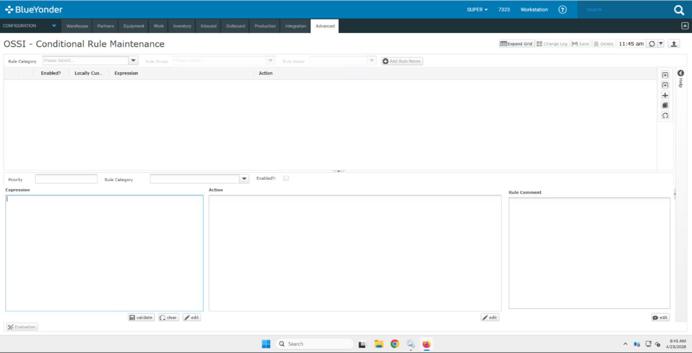
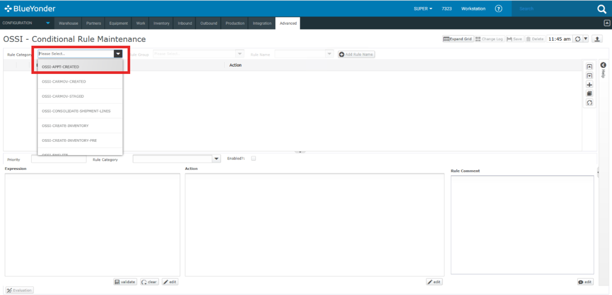
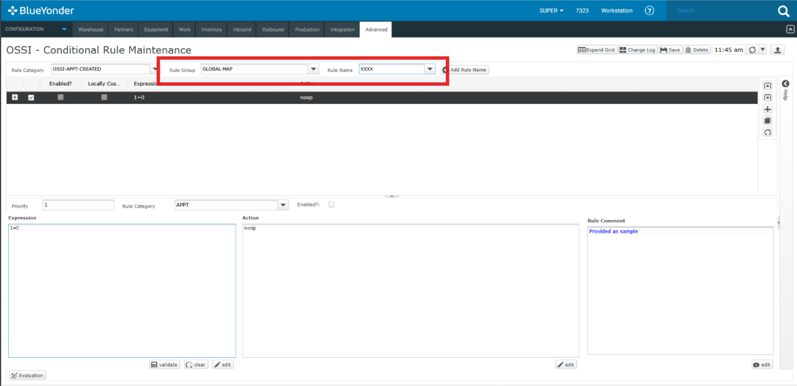
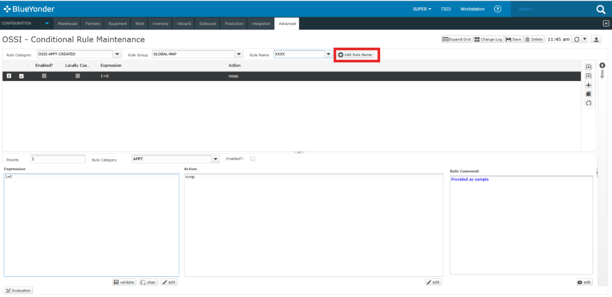
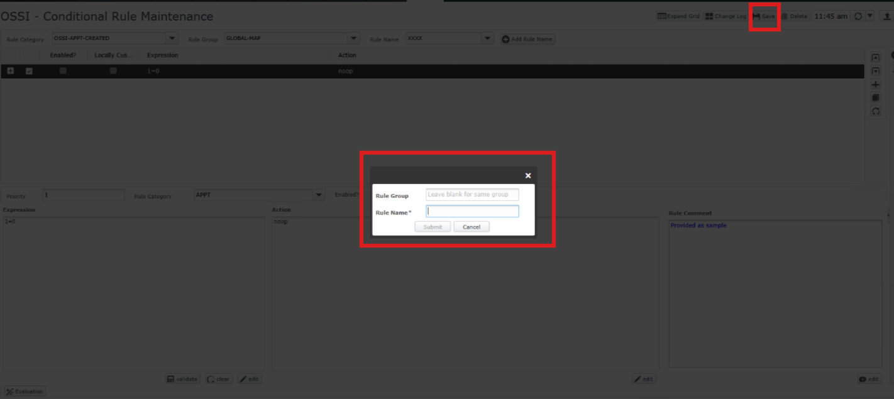
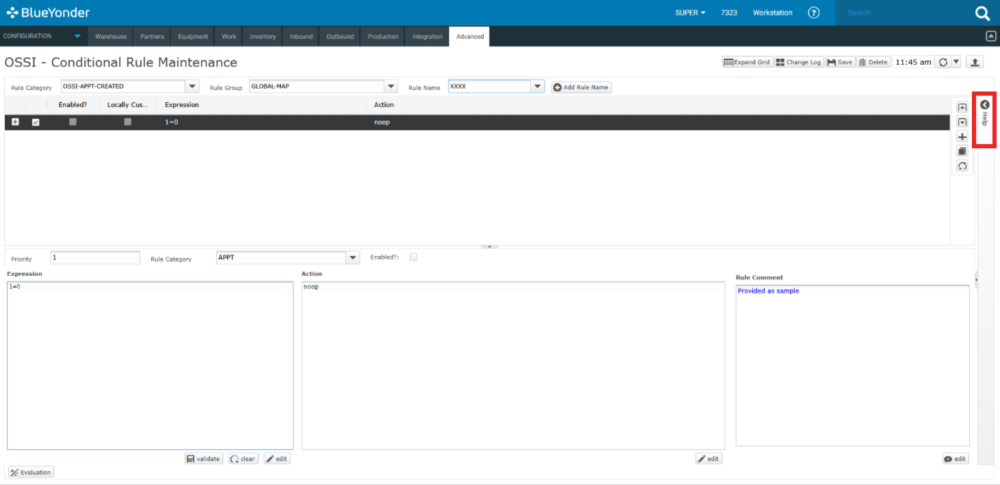
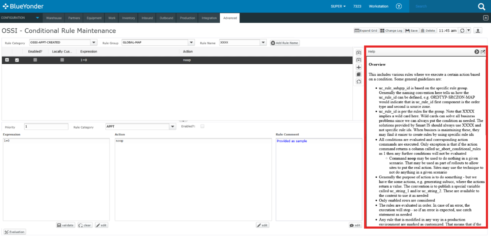
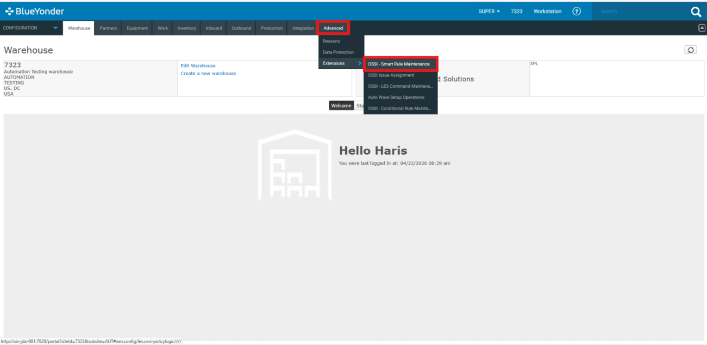
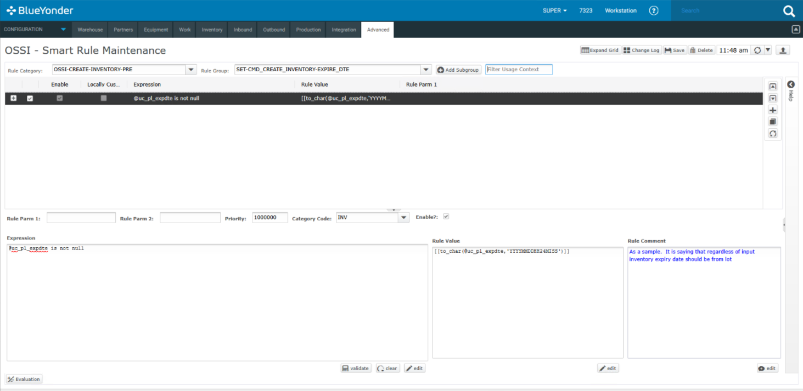

# Getting Started 

Learn how to access the Smart Rule Engine and start using its features.

1. Login to your Blue Yonder Portal and navigate to Advanced from the Configuration Menu.

  
   

From here you can access Smart Rule and Conditional Rule.

2. Select the OSSI Conditional Rule.

  
   

3. You can Select your Rule Category from the drop down. 

  
   

4. Select the relevant Rule group and Rule name from the drop-down.

  
   

5. You will see the related expression and action for the selected Rule. You can also add a new Rule from the "Add new Rule" button. 

  
   

5. You can add the Rule name here and select submit. You can also save this.

  
   

6. For some additional information you can visit help. 

  
   

   Here you can some information regarding Conditional Rule.

  
   

7. Similary for Smart Rule you can navigate from the configuration menu to Advanced. 

  
   

8. From here you can view your smart rule and add new as well. 

  
   

---